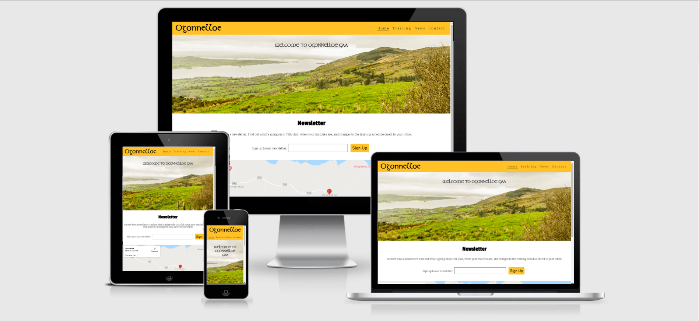
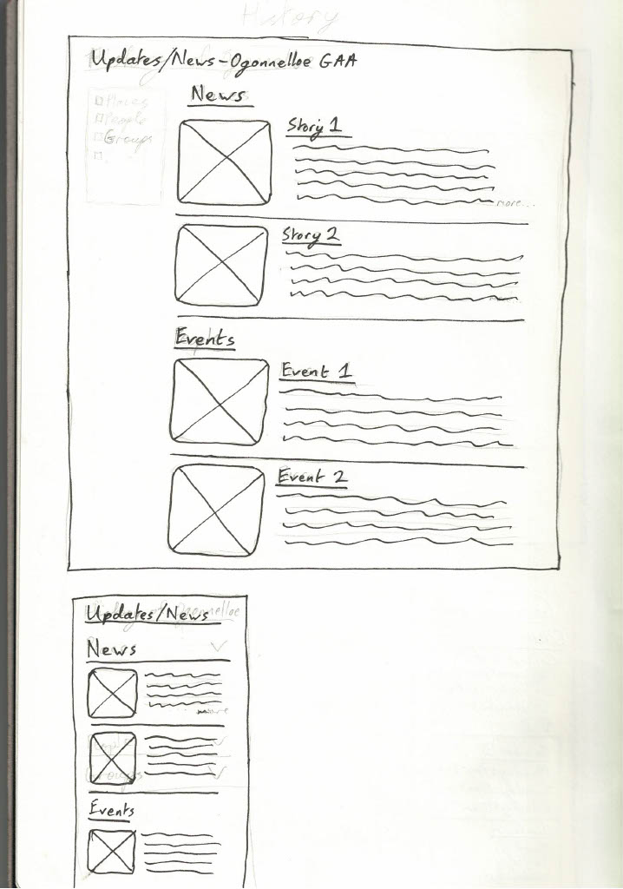
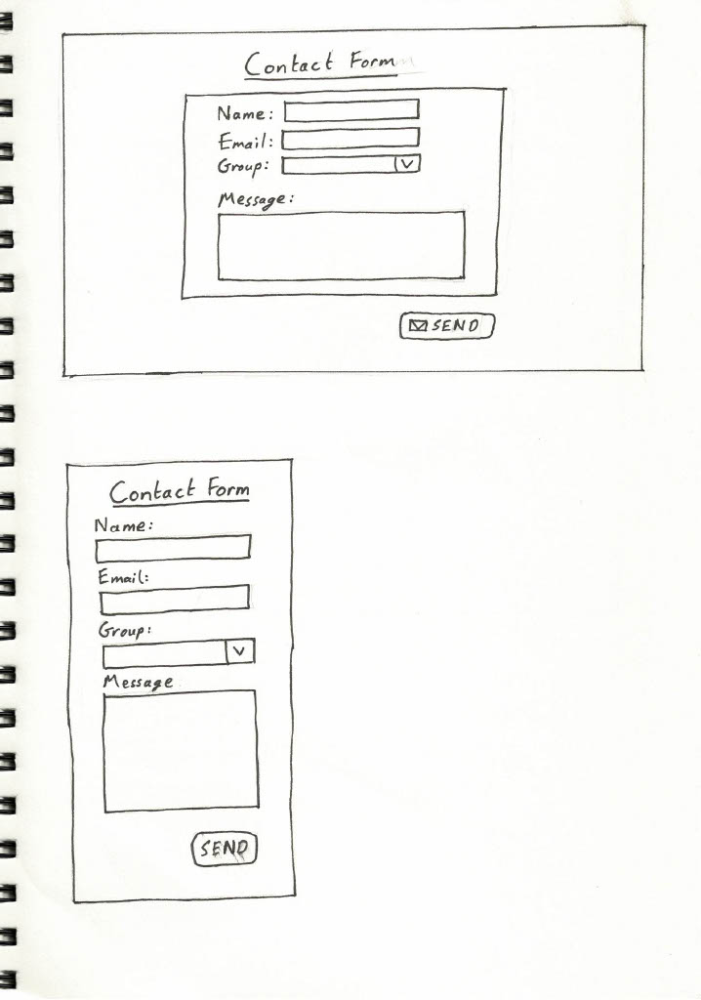
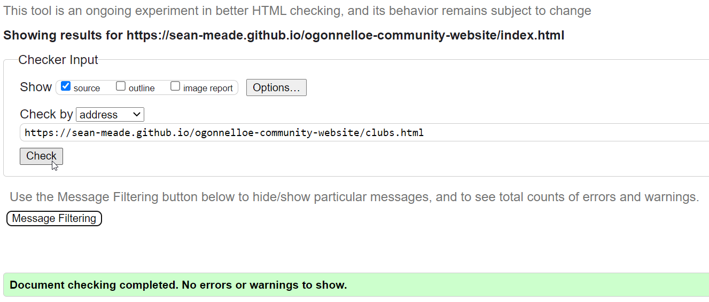
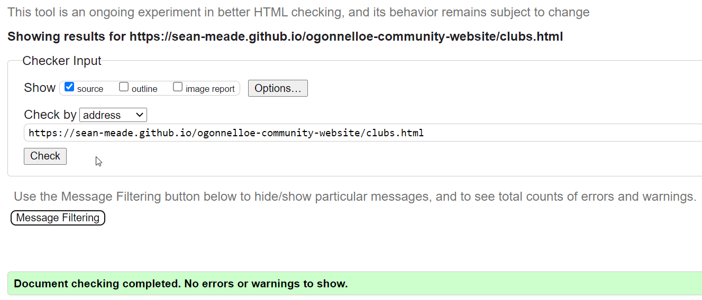
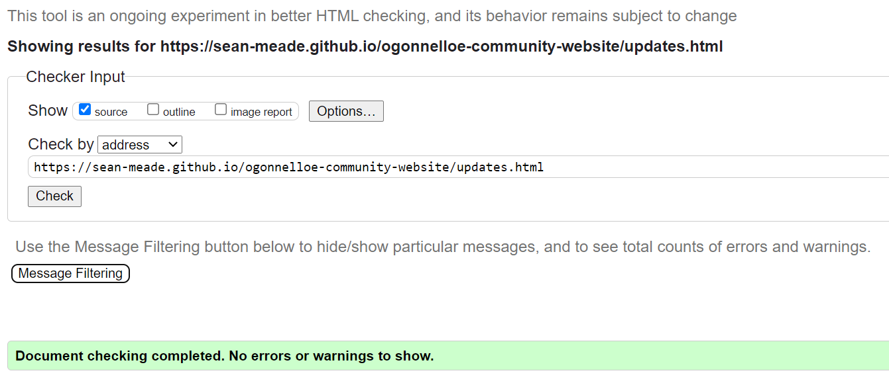

### Ogonnelloe GAA Website
---
[View the live project here.](https://sean-meade.github.io/ogonnelloe-community-website/)

This is a website project for the members of the GAA in the community of Ogonnelloe. It is designed to be responsive and accessible on a range of devices, making it easy to navigate for current or potential members. This website was built for my first project for the softwre development course for code institute.

OgonnelloeGAA.com is a site that hopes to end the confusion for players. Growing up there has always been confusion about training times, events, and news about the club. What time is training? 8pm ... John said it was 7pm this week. When is that fundraiser on? Mam said it was Saturday week but Dad swears it was Friday. Who won player of the match there on the weekend? Susan ... No way had to be Elaine! 

This has been a common acurance. So OgonnelloeGAA.com is set to remove all doubts. It has an input field for email sign up for the newsletter, which contains the upcoming events. The Training page lays out the training times for the club for the different age groups. The news and events page lays out some of the top stories involving the club currently. Finally, there is a contact page to make it easy to request information from the club. Players are just going to have to find other things to argue over because all their questions will be answered!


The orignal scope for this website was to be a community website. Due to content availability I have to pivot. So I have decided to focus on one corner stone of our community of Ogonnelloe; the Gaielge Athletic Association (GAA).



# User Experience (UX)

## User stories
- ### First Time Visitor Goals
	- As a First Time Visitor, I want to easily understand the main purpose of the site and learn more about the organisation.
	- As a First Time Visitor, I want to be able to easily navigate throughout the site to find content.
	- As a First Time Visitor, I want to find the time and place for my training session.
	- As a First Time Visitor, I want to be able to contact the relevant people of the Ogonnelloe GAA club.
	- As a First Time Visitor, I want to see what has happened recently in the club
- ### Returning Visitor Goals
	- As a Returning Visitor, I want to find information about my traing sessions.
	- As a Returning Visitor, I want to find the best way to get in contact with the organisation with any questions I may have.
	- As a Returning Visitor, I want to find a sign up for the newsletter.
	- As a Returning Visitor, I want to find community links.
- ### Frequent User Goals
	- As a Frequent User, I want to check to see my training times.
	- As a Frequent User, I want to check to see this years accomplishments.
	- As a Frequent User, I want to sign up to the Newsletter so that I am emailed any major updates and/or changes to the website or organisation.

## Design
I want the design of the website to inform and empower the vistors to access useable information relating to Ogonnelloe GAA. I want to keep the design and navigation simple to ensure it is accessable for all ages. I want to make the site responsive in order for it to be accessable on a range of devices. I want to make this website a tool for people to use to get more involved in the GAA club of Ogonnlloe. 

- ### Colour Scheme
	- The primary and secondary colours I have chosen to use are black (`#FFC125`) and amber (`#000000`). These are the colours on the Ogonnelloe flag. These colours are very bold so I wanted to offset this with a light colour to highlight certain areas. This colour was light grey (`#D2D5DD`).
  - The amber colour was found using the color selector on chrome dev tools. I used the selector to find the shade of each color that I felt complimented the site well and fitted with the bands look. 
- ### Typography
	- The Celtic font from fontzip.com is used for the Logo. Patua One is used for all headings with Arial as a web safe backup font. Both fonts are very strong, supportive (to the rest of the content) and impactful which mirror the ethos of Ogonnellow GAA.For the body text the font Merriweather was chosen with serif as backup. Both being clean and precise as only Ogonnelloe can be!
- ### Imagery
	- The banner image is of very reckoniable hillside in Ogonnelloe. It is both familiar to residents of Ogonnelloe and welcoming to new potential members.

## Wireframes
Please find notes on changes in design in the appendix (follow the links below)

Home Page Wireframe - [View](#home-page-wireframe)

Training Page Wireframe - [View](#training-page-wireframe)

News Page Wireframe - [View](#news-page-wireframe)

Contact Page Wireframe - [View](#contact-page-wireframe)

# Features

Existing Features:

Navigation Bar:
-	Featured on all pages, the full responsive navigation bar includes links to the Home, Gallery and Sign-Up page and is identical in each page to allow for easy navigation. The Logo is also a link to Homepage.

-	This feature allows users to easily navigate from page to page across all devices.

The landing page image:

-	The landing includes a photograph with text overlay. The image is a very recognizable view of Ogonnelloe and the text immediately informs the user the website is for information regarding Ogonnelloe GAA.

Newsletter Sign Up:

-	The landing page also includes a user input allowing users to sign up for the Ogonnelloe GAA newsletter.

Embedded Google maps:

-	This feature allows a user to see at a glance the lay of the land around the Ogonnelloe GAA pitch and also get directions to the pitch is they are new to the area.
The Footer:

-	The footer provides the user the ability to navigate the site in the same the navigation bar does without the need to scroll all the way back up the page.

-	It also gives the information of who built the website and a link to their GitHub.

Club information:

-	This feature gives the user information on the contact organization (Hurling or Camogie), the logo, and the individual teams and the times they meet for training.
-	The contact information includes an email address, phone number, location for training and social medias.

Main News Video:

-	The news and events page contains a video that the user can play and pause.
News Articles:
-	The news Articles gives the user a brief summary of the latest news bytes of Ogonnelloe GAA.

Contact Form:

-	This form gives the ability for the user to contact the main email for either Camogie or Hurling for any enquiries they may have.

Features left to Implement:
Events page:
-	A page informing users of GAA events of interest.

# Technologies Used
## Languages Used
  - [HTML5](https://developer.mozilla.org/en-US/docs/Web/Guide/HTML/HTML5)
  - [CSS3](https://developer.mozilla.org/en-US/docs/Web/CSS)

## Frameworks, Libraries & Programs Used
  1. [Google Fonts](https://fonts.google.com/):
	  - Google fonts were used to import the 'Merriweather' and 'Passion One' fonts into the style.css file which is used on all pages throughout the project.
  2. [Font Awesome](https://fontawesome.com/):
	  - Font Awesome was used on home, training, contact pages to add icons for aesthetic and UX purposes.
  3. [Git](https://git-scm.com/):
	  - Git was used for version control by utilizing the Gitpod terminal to commit to Git and Push to GitHub.
  4. [GitHub](https://github.com/):
	  - GitHub is used to store the projects code after being pushed from Git.
  5. [Font Zip]():
	  - Fontzip was used to download and use the 'Celtic' font used on the logo.
  6. [Google Chrome Developer Tools](https://developer.chrome.com/docs/devtools/):
	  - Google chromes built in developer tools were used to help with the styling of the site and to help fix any bugs found.
  7. [Getbootstrap](https://getbootstrap.com/):
	  - Google Chrome Developer Tools was used to get some styling suggestions for forms from the Getbootstrap website.
  8. [LunaPic]():
	  - LunaPic was used to edit images. This is resizing, cropping, and changing image type.
  9. [CompressPNG]():
	  - CompressPNG was used to compress in png images for loading faster..
  10. [Am I Responsive Design]():
	  - Am I responsive was used to crete the first image of the site on multiple devices.
  11. [Online Convert](https://www.online-convert.com/):
	  - Google Chrome Developer Tools was used to get some styling suggestions for forms from the Getbootstrap website.
  12. [Google Lighthouse](https://developers.google.com/web/tools/lighthouse):
	  - Google lighthouse was used to test the performance of my site.  

# Testing

Validator Testing
HTML

  -	No errors were returned when passing through the official [W3C validator]()

CSS

  -	No errors were found when passing through the official [(Jigsaw) validator]()

Unfixed Bugs

-	You 

# Testing User Stories from User Experience (UX) Section

- First Time Visitor Goals
  - As a First Time Visitor

# Deployent

The site was deployed to GitHub pages. The steps to deploy are as follows:
1.	In the repository navigate to the settings tab.
2.	Select Pages from the navigation on the lefthand side.
3.	Select main (sometimes called master) branch, the root (meaning the root directory of your repo) and then save.
You will then be presented with a link to your hosted repository located right above the Source settings you just saved.


### Forking the GitHub Repository

By forking the GitHub Repository we make a copy of the original repository on our GitHub account to view and/or make changes without affecting the original repository by using the following steps...

1. Log in to GitHub and locate the [GitHub Repository](https://github.com/)
2. At the top of the Repository (not top of page) just above the "Settings" Button on the menu, locate the "Fork" Button.
3. You should now have a copy of the original repository in your GitHub account.

### Making a Local Clone

1. Log in to GitHub and locate the [GitHub Repository](https://github.com/)
2. Under the repository name, click "Clone or download".
3. To clone the repository using HTTPS, under "Clone with HTTPS", copy the link.
4. Open Git Bash
5. Change the current working directory to the location where you want the cloned directory to be made.
6. Type `git clone`, and then paste the URL you copied in Step 3.

```
$ git clone https://github.com/sean-meade/ogonnelloe-community-website.git
```

7. Press Enter. Your local clone will be created.

```
$ git clone https://github.com/sean-meade/ogonnelloe-community-website.git
> Cloning into `CI-Clone`...
> remote: Counting objects: 10, done.
> remote: Compressing objects: 100% (8/8), done.
> remove: Total 10 (delta 1), reused 10 (delta 1)
> Unpacking objects: 100% (10/10), done.
```

Click [Here](https://help.github.com/en/github/creating-cloning-and-archiving-repositories/cloning-a-repository#cloning-a-repository-to-github-desktop) to retrieve pictures for some of the buttons and more detailed explanations of the above process.

## Credits


## Appendix

### Wireframes

#### Home Page Wireframe

Notes: I added a Google maps iframe just before the footer. This shows Ogonnelloe on the map. I chose to add this because it was useful and added to homepage. 


[Back to Wireframe Section](#wireframes)

#### Training Page Wireframe

Notes: I changed the contact information to the right hand side as it looks better and on mobile the crest (on the left) is on top. The crest was also chosen instead of Google maps because it is already in the homepage.


[Back to Wireframe Section](#wireframes)

#### News Page Wireframe

Notes: A video banner was added to give more of an impression when first visiting the news page. I chose to have images on top of text because I thought it looked cleaner and fitted in more with the spacious flow of the site. Decided to just call it news and have one title rather then split it because it fitted in more with the spacious flow of the site.



[Back to Wireframe Section](#wireframes)

#### Contact Page Wireframe



[Back to Wireframe Section](#wireframes)

## Validation

#### Home Page Validation



#### Training Page Validation



#### News Page Validation



#### Contact Page Validation


#### CSS Validation

